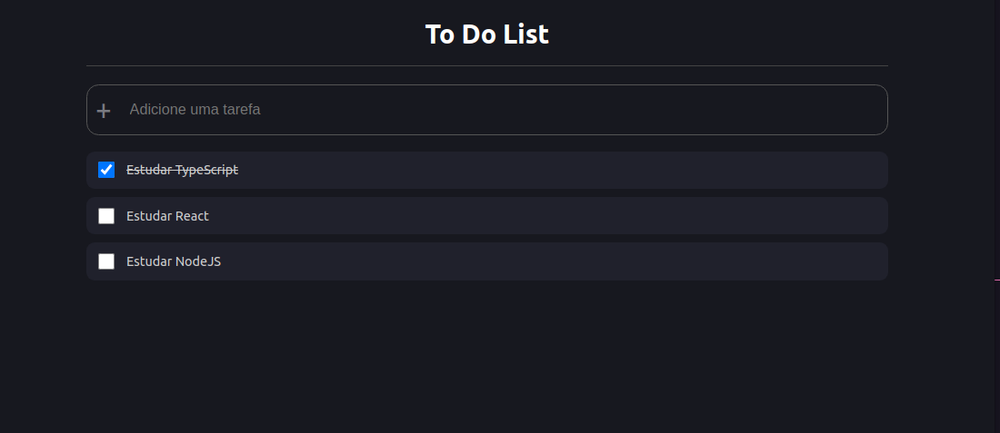

### Project List Task (lista de tarefa)
(Projeto feito apenas para colocar aprendizado inicial do TypeScript e Styled Components)

### Functionalities

+ Adding new task

+ Check and unchecked completed tasks

+ Saving to a possible API

<h2>Screen Main</h2>

<p></p>

### Instalation Frontend

1. `npx create-react-app todo --template typescript` (_--template typescript_ --> adding typescript)

2. `npm install styled-components` (lib css with js)

3. `npm install -D @types/styled-components` (adding the types)


<h3>OBS: Apareceu esse erro de typescript</h3>

```
TypeScript/todo/node_modules/react/jsx-runtime.js' implicitly has an 'any' type.
```
solucionado com essa adição ` "noImplicitAny": false` em `tsconfig.json` (adicionado dentro do primeiro objeto) 